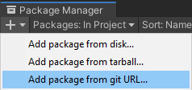
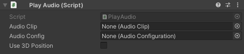
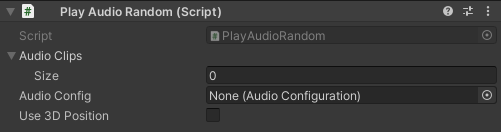

# Audio-Manager
Plays audio using an audio source object pool.

## Prerequisites
This package uses the `Singleton` package. It is recommended to install the package before installing this one.

[https://github.com/Jason-Skillman/Unity-Singleton](https://github.com/Jason-Skillman/Unity-Singleton)

---
**Note:**

Prerequisite package can also be installed with the same steps below.

---

## How to install
This package can be installed through the Unity `Package Manager` with Unity version 2019.3 or greater.

Open up the package manager `Window/Package Manager` and click on `Add package from git URL...`.

)

Paste in this repository's url.

`https://github.com/Jason-Skillman/Audio-Manager.git`

)

Click `Add` and the package will be installed in your project.

---
**NOTE:** Unity 2019.2 or lower

Other ways to install the package
1. To install the package in an earler version of Unity you can clone this git into your project's `Packages` folder.
1. Another alternative would be to download the package and in the `Package Manager` click on `Add package from disk...` and select the package's root folder.

---

## How to use
You can create a new `AudioManager` and add it to your scene by right clicking in the hierarchy `Audio/Audio Manager`. Only one `AudioManager` should exist within any given scene. 

## Audio components

### Play Audio component
)

|Member|Description|
|---|---|
|`Audio Clip`|The audio clip to play.|
|`Audio Config`|The audio configuration file to use when playing the audio.|
|`Use 3D Position`|Is the audio playing is 3D space? Uses this gameobject's location.|

### Play Audio Random component
)

|Member|Description|
|---|---|
|`Audio Clips`|Randomly chooses an audio clip to play from the array.|
|`Audio Config`|The audio configuration file to use when playing the audio.|
|`Use 3D Position`|Is the audio playing is 3D space? Uses this gameobject's location.|

Both components can trigger its audio clip by calling `Play()` in a `UnityEvent` or by another script. This method is also avilable in the context menu for debugging in the editor.

## Audio Configuation
`AudioConfiguation` is a scriptable object filled with common audio settings. 

To create a new `AudioConfiguation` settings file go to `Create/Audio/AudioConfiguation`. 
